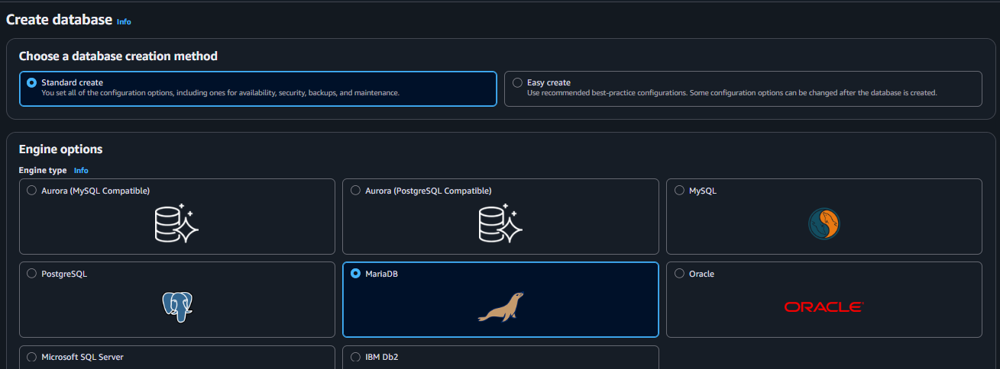
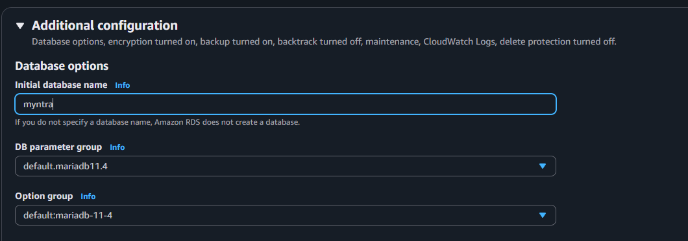
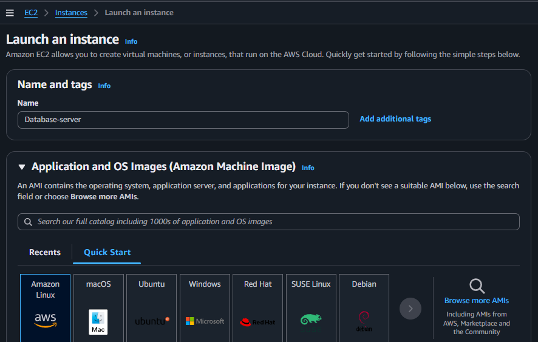
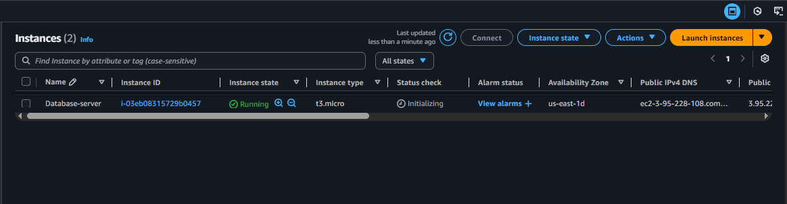
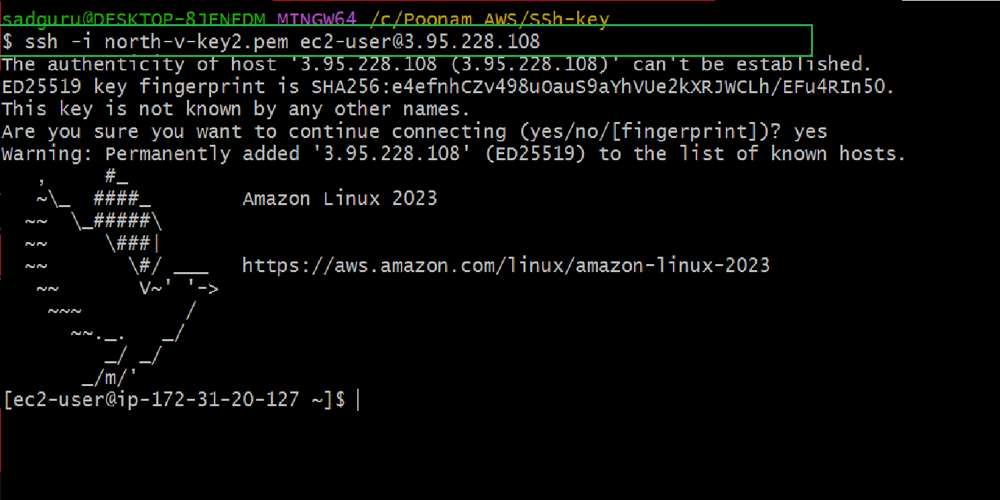
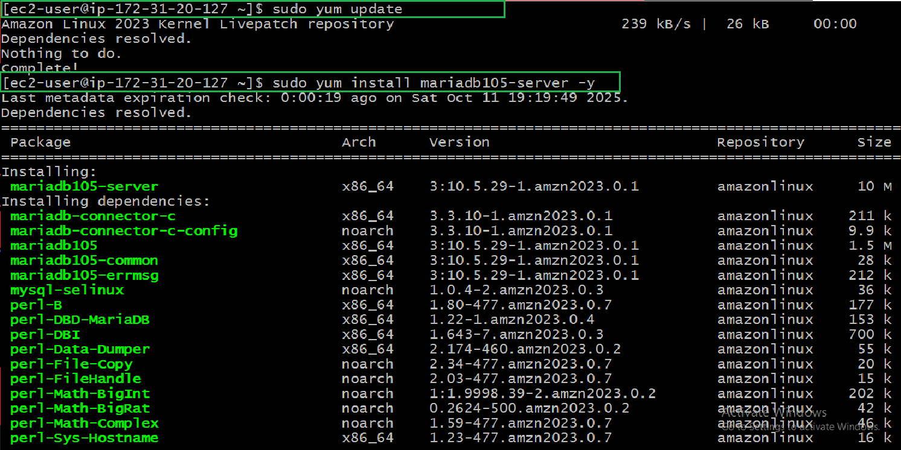
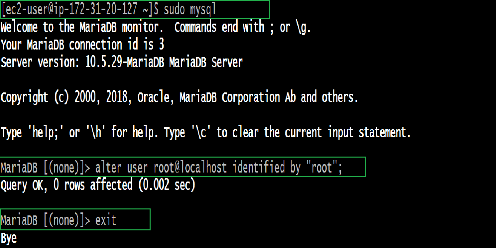
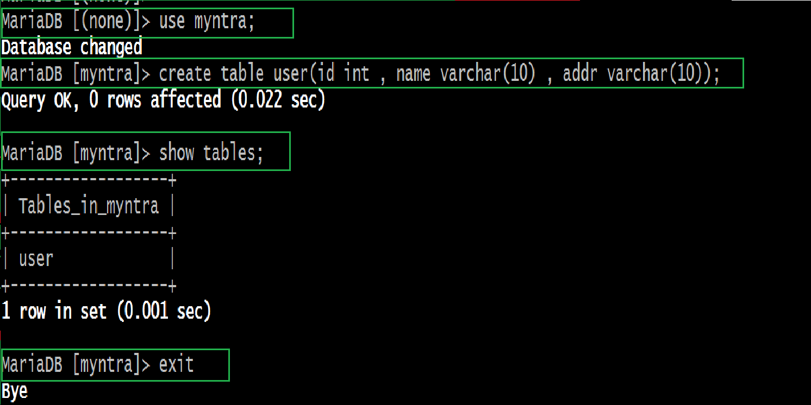
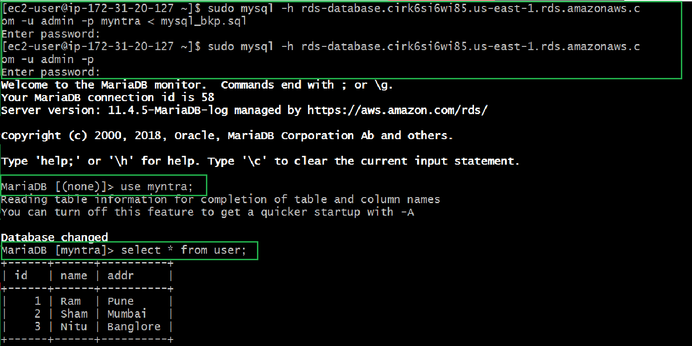

#  Database Migration to Amazon RDS (Manual Method using EC2 and MariaDB)

---

##  Overview

In this guide, we’ll perform a **manual migration** of a MariaDB database from an **EC2 instance** to an **Amazon RDS** instance.  
This process demonstrates how to:
- Set up an RDS database  
- Create and populate a local MariaDB database on EC2  
- Export and import the data into RDS  

---

## Step 1 — Create RDS Database

1. In the **AWS Management Console**, search for **“RDS”**.  
2. Click on **Aurora and RDS** → then click on **Create Database**.  
3. Choose: **Standard Create**  
4. **Engine type:** `MariaDB`  
      
5. **DB identifier name:** `RDS-database`  
6. **Credentials settings:** Select **Self-managed**  
7. Click on **Auto-generate password**  
   
8. **VPC security group:** Select an existing **Security Group**  
9.  **Initial database name:** `Myntra`  
    
10. Finally, click on **Create database**
    

---

## Step 2 — Create EC2 Instance (Database Server)

1. Go to **EC2 → Instances → Launch Instance**  
2. **Name:** `Database-server`  
3. **AMI:** `Amazon Linux`  
   
4. **Key pair:** Select your created key pair  
5. **Network settings:** Select existing or new Security Group 
6. Click on **Launch Instance**
  

---

## Step 3 — Connect to EC2 via SSH

- Use the following command to connect to your EC2 instance:

         ssh -i private-key.pem ec2-user@<EC2-Public-IP>
  
---

## Step 4 — Install and Start MariaDB Server
- Update the instance and install MariaDB:

      sudo yum update -y
      sudo yum install mariadb105-server -y
  
- Start and enable the service:

      sudo systemctl start mariadb
      sudo systemctl enable mariadb
      sudo systemctl status mariadb
  
---

## Step 5 — Set Root Password
- Access MariaDB shell and set a password for the root user:

      sudo mysql
      ALTER USER root@localhost IDENTIFIED BY "root";
      EXIT;
  
---

## Step 6 — Create Local Database and Table
- Login with your new credentials and create a sample database:

      sudo mysql -u root -p
- Then execute:
  
        CREATE DATABASE myntra;
        SHOW DATABASES;
        USE myntra;
        CREATE TABLE user (id INT, name VARCHAR(10), addr VARCHAR(10));
        INSERT INTO user VALUES (1, "Ram", "Pune"),(2, "Sham", "Mumbai"),(3, "Nitu", "Banglore");
        SELECT * FROM user;
        EXIT;
  
  
---

## Step 7 — Export Local Database
- Use mysqldump to take a backup of your EC2-hosted database:

        mysqldump -u root -p myntra > myntra.sql
- When prompted, enter password: **root**
- Verify the file:

        ls
  - You should see the backup file myntra.sql
  
---

## Step 8 — Connect to RDS Database
- Now connect to your RDS instance using its endpoint and admin credentials:

      sudo mysql -h <RDS-endpoint> -u admin -p
- When prompted, enter the auto-generated password copied from RDS.
  - Inside RDS:

        SHOW DATABASES;
        USE myntra;
        CREATE TABLE user ( id INT, name VARCHAR(10), addr VARCHAR(10));
        SHOW TABLES;
        EXIT;
  
  
---

## Step 9 — Import Data into RDS
- Now import the EC2 database dump into your RDS instance:

      sudo mysql -h <RDS-endpoint> -u admin -p myntra < myntra.sql
   - Enter the same RDS password.
- Verify the migration:

      sudo mysql -h <RDS-endpoint> -u admin -p
- Then inside MariaDB shell:

        USE myntra;
        SELECT * FROM user;
- You’ll see all three records:
  
- Database migration successful!
---

## Summary
- In this manual migration process, we:
    - Created a MariaDB RDS instance
    - Set up a local MariaDB database on EC2
    - Exported data using mysqldump
    - Imported it into Amazon RDS using mysql client
- This approach is perfect for small to medium workloads and helps you understand the underlying flow of database migration.
---

## **Tip:** Always store your RDS admin password safely and restrict access using security groups and IAM roles.

